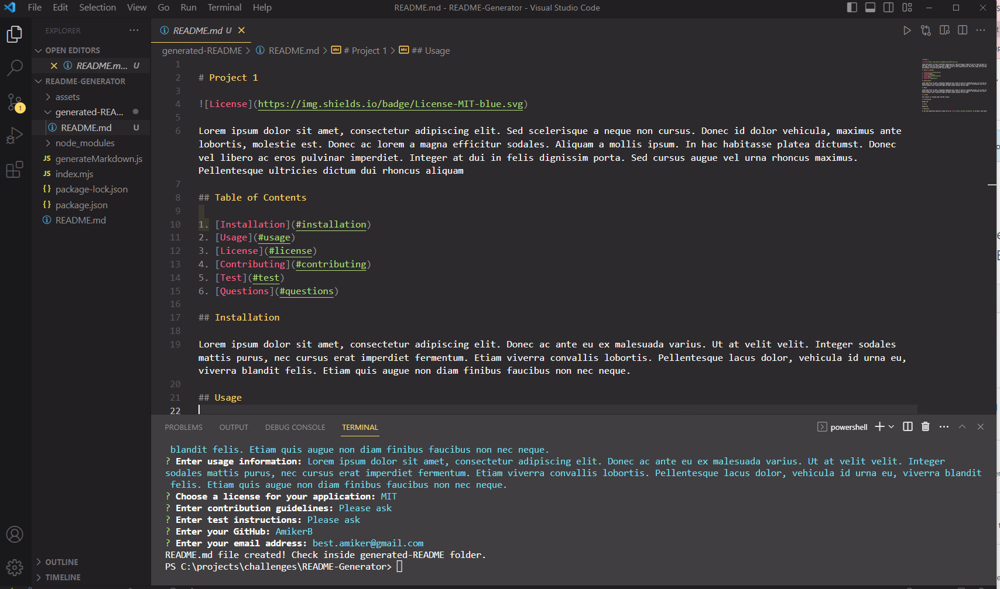

# README Generator

This README generator allows the user to create a README file by using a command-line application based on the users input. It uses the [Inquirer package](https://www.npmjs.com/package/inquirer). This allows the user to easily and quickley generate a professional README file which they can then copy into their project. 

## Table of Contents
 
1. [Installation](#installation)
2. [Usage](#usage)

## Installation

1. Go this application's repository and click on the "Code" button, then select "Clone repository" and copy the URL provided.
2. Open your terminal or command prompt, navigate to the directory where you want to clone the repository, and run the command git clone <URL> (where <URL> is the URL you copied in step 1). This will create a new directory containing the cloned repository.
3. After the repository has finished cloning, navigate into the new directory by running the command cd <directory-name> (where <directory-name> is the name of the directory that was created during cloning).
4. Finally, run the command code . to open the repository in Visual Studio Code.

## Usage

1. Open the terminal and navigate to the directory/folder titled "README-Generator".
2. Run the command node index.mjs in the terminal to start the application. This will execute the JavaScript code in the index.mjs file.
3. Answer the prompts that are displayed in the terminal about your project. These prompts may include questions about your project's title, description, installation instructions, usage, license, and more. These answers will be used to generate your README file.
4. If there are no errors in the process, there will be a message displayed in the terminal to indicate that your README file has been successfully created.
5. Finally, you can find your generated README file inside the generated-README folder, which should be located in the same directory as the index.mjs file.

### Screenshot of Application

The screenshot shows an open terminal window with some text output on the screen. The user's project information is displayed in the terminal output. The generated README file is shown open in a text editor. This file is located in a directory titled "generated-README" within the project's directory. The generated README file contains all of the project information that was displayed in the terminal output, formatted in a readable and professional way. The user can use this file as their project's README file.

